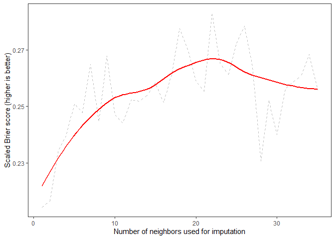

<!-- README.md is generated from README.Rmd. Please edit that file -->

# Imputation for predictive analytics (`ipa`)

<!-- Think about statistics in medicine submission -->

The goal of `ipa` is to make imputation in predictive modeling workflows
more straightforward and efficient. The main functions in `ipa` are

1.  `brew` Create a container to hold your imputations

2.  `spice` (optional) set parameters that govern the number of
    imputations for the given brew

3.  `mash` fit models that will provide imputations

4.  `ferment` impute missing values in training and (optionally) testing
    data

5.  `bottle` output the imputed datasets in a
tibble.

## Installation

<!-- You can install the released version of ipa from [CRAN](https://CRAN.R-project.org) with: -->

<!-- ``` r -->

<!-- install.packages("ipa") -->

<!-- ``` -->

You can install the development version of `ipa` from
[GitHub](https://github.com/) with:

``` r
# install.packages("devtools")
devtools::install_github("bcjaeger/ipa")
```

## Example

First, we’ll load some packages and set a seed for reproducibility

``` r

library(tidymodels)
library(tidyverse)
library(data.table)
library(ipa)
library(magrittr)
library(ranger)
library(DescTools)

set.seed(329)
```

### Credit data

We will be adding missing values to the `credit` data (see
`?recipes::credit_data`)

``` r

data("credit_data")

splits <- credit_data %>% 
  as_tibble() %>% 
  drop_na() %>% 
  add_missing(omit_cols = c('Status', 'Job', 'Price', 'Income'), 
    miss_proportion = 3/5,
    miss_pattern = 'mar') %>% 
  initial_split()

trn <- training(splits)
tst <- testing(splits)
```

### K-nearest-neighbor imputation

K-nearest-neighbors (KNN) is a flexible and useful method for imputation
of missing data. Briefly, each missing value is imputed by aggregating
or randomly sampling a value from the K observations with greatest
similarity to the current obervation. Conventional methods for KNN
provide imputations using a single value of K, which makes it hard to
identify an optimal value of K. Ideally, one would generate imputed
datasets using a number of different values of K, and then use whichever
K provided the most accurate imputed values or the most accurate
prediction model (usually, these K are the same or similar). This is one
of the things `ipa` does.

``` r

nbrs_brew <- brew(trn, outcome = Status, flavor = 'kneighbors') %>%
  verbose_on(level = 1) %>% 
  spice(with = spicer_nbrs(neighbors = 1:35)) %>% 
  mash() %>% 
  ferment(testing = tst, dbl_impute = FALSE) %>% 
  bottle(type = 'tibble')
#> Imputing Seniority (N = 2133)
#> Imputing Home (N = 2541)
#> Imputing Time (N = 2570)
#> Imputing Age (N = 1894)
#> Imputing Marital (N = 2409)
#> Imputing Records (N = 1925)
#> Imputing Expenses (N = 1979)
#> Imputing Assets (N = 2194)
#> Imputing Debt (N = 2019)
#> Imputing Amount (N = 2244)
#> Fitting models to impute missing values in testing using nearest neighbors
#> Imputing Seniority (N = 703)
#> Imputing Home (N = 842)
#> Imputing Time (N = 858)
#> Imputing Age (N = 593)
#> Imputing Marital (N = 779)
#> Imputing Records (N = 607)
#> Imputing Expenses (N = 634)
#> Imputing Assets (N = 743)
#> Imputing Debt (N = 654)
#> Imputing Amount (N = 744)
```

### Evaluate imputations

If our goal is to make an accurate model, then the best value of K is
the one that maximizes model accuracy. Using the pairs of imputed
training and testing data from bottled `ipa_brew` is a fairly
straightforward approach to finding out which imputed dataset provides
that model. Here, we apply the `parsnip` interface to fit and validate
one boosted decision tree ensemble to each imputed training and testing
set.

``` r

anly <- nbrs_brew %>% 
  mutate(
    bscor = map2_dbl(training, testing, 
      .f = ~ boost_tree(
        mode = 'classification',
        mtry = 4,
        trees = 50,
        tree_depth = 2
      ) %>%
        set_engine('xgboost') %>% 
        fit(Status ~ ., data = .x) %>% 
        predict(new_data = .y, type = 'prob') %>% 
        BrierScore(
          resp = as.numeric(tst$Status == 'good'),
          pred = .[, 2, drop = TRUE],
          scaled = TRUE
        )
    )
  )

anly
#> # A tibble: 35 x 6
#>    impute k_neighbors aggr_fun  training           testing            bscor
#>     <int>       <int> <chr>     <list>             <list>             <dbl>
#>  1      1           1 mean_mode <tibble [3,030 x ~ <tibble [1,009 x ~ 0.225
#>  2      2           2 mean_mode <tibble [3,030 x ~ <tibble [1,009 x ~ 0.242
#>  3      3           3 mean_mode <tibble [3,030 x ~ <tibble [1,009 x ~ 0.248
#>  4      4           4 mean_mode <tibble [3,030 x ~ <tibble [1,009 x ~ 0.245
#>  5      5           5 mean_mode <tibble [3,030 x ~ <tibble [1,009 x ~ 0.252
#>  6      6           6 mean_mode <tibble [3,030 x ~ <tibble [1,009 x ~ 0.252
#>  7      7           7 mean_mode <tibble [3,030 x ~ <tibble [1,009 x ~ 0.254
#>  8      8           8 mean_mode <tibble [3,030 x ~ <tibble [1,009 x ~ 0.244
#>  9      9           9 mean_mode <tibble [3,030 x ~ <tibble [1,009 x ~ 0.262
#> 10     10          10 mean_mode <tibble [3,030 x ~ <tibble [1,009 x ~ 0.250
#> # ... with 25 more rows
```

Results show that the optimum value of K is somewhere around 20-25. Good
thing we didn’t use the default value of 5\!

``` r
      
ggplot(anly, aes(x = impute, y = bscor)) +
  theme_bw() + 
  theme(panel.grid = element_blank()) +
  geom_line(col = 'grey', linetype = 2) + 
  geom_smooth(col = 'red', se = FALSE) + 
  labs(x = 'Number of neighbors used for imputation', 
    y = 'Scaled Brier score (higher is better)')
#> `geom_smooth()` using method = 'loess' and formula 'y ~ x'
```


